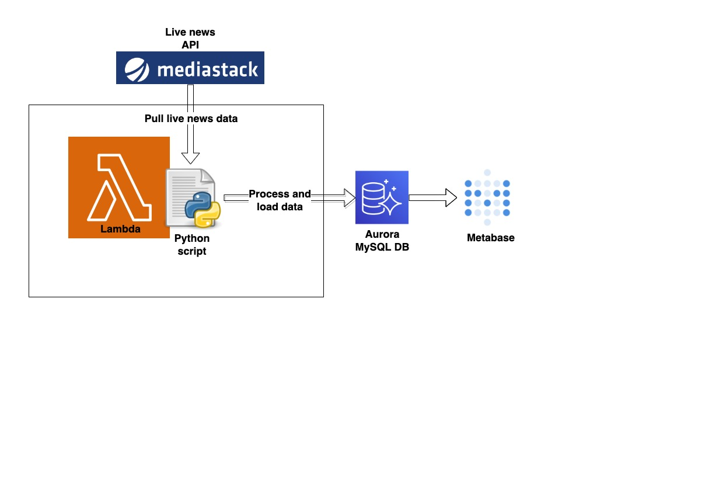

# Popular News Headlines

The aim of this project is to build a live dashboard showing the most frequently used phrases in news headlines to see if any useful insights into recents trends can be gained. This is done by building a data pipeline in python that pulls live news data from [Mediastack API](https://mediastack.com) and building a Metabase dashboard to visualise the data.

# Architecture

 
- The Mediastack API provides an HTTP GET endpoint that delivers live news data in JSON format.
- The [python script](lambda_function.py) is scheduled to run every 5 mins by Lambda to pull all the latest news data, from which the script extracts the title and description of each news story and transforms them into phrases. The transformation is done by grouping each word with up to 3 subsequent words together (limited words to reduce complexity).
- The script then loads the phrase data into a MySQL DB (Aurora). OLAP databases like Snowflake and Redshift would be more suitable for the analytical queries that will be running on Metabase, but for this project it is unlikely that more than 5 million rows will need to be processed by any single query. Therefore, a small Aurora instance is chosen as it is much cheaper than a Redshift or Snowflake cluster. 
- Run [SQL queries](/metabase_sql) from Metabase to extract the data from Aurora and process it further to create the dashboard below.

# [Live Dashboard](https://blackmamba.metabaseapp.com/public/dashboard/2dbe9036-ecfd-492e-a9b8-6c3489a8ff5b)

- The dashboard is populated with near real-time data since the data pipeline runs every 5 minutes.
- The dashboard shows the most frequently used phrases for today and the past week, as well as the most trending phrases for today.

# Comments/conclusions
- Most of the top phrases are only frequently used because they are very common the English language, not because they are trending, making it difficult to separate them from real trending phrases.
- Also, analysing 2 to 4 word phrases may not be a good idea since they are too short to convey any useful information
